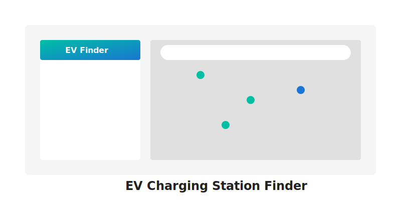

# EV Charging Station Finder

A comprehensive EV charging station booking platform that simplifies electric vehicle charging infrastructure access in India.



## Features

- **Interactive Map**: Find charging stations near you using Leaflet maps
- **Detailed Station Information**: View comprehensive details about each charging station
- **Real-time Availability**: Check which stations have available slots in real-time
- **Advanced Filtering**: Filter stations by fast charging availability, price range, and slot availability
- **Booking System**: Book charging slots at your preferred station
- **Recent Searches**: Keep track of your recent location searches
- **Responsive Design**: Works on mobile, tablet, and desktop devices

## Tech Stack

- **Frontend**: React, Vite, TailwindCSS, Shadcn/UI
- **Maps**: Leaflet with OpenStreetMap
- **Authentication**: Firebase Authentication
- **Backend**: Node.js with Express
- **Database**: In-memory storage (easily replaceable with PostgreSQL)

## Setup Instructions

### Prerequisites

- Node.js (v14 or higher)
- npm (v6 or higher)
- Firebase account

### Firebase Setup

1. Go to the [Firebase Console](https://console.firebase.google.com/) and create a new project
2. In your project's console, click "Add app" and select the Web platform (</>) 
3. Register your app with a name (e.g., "EV Charging Finder")
4. Copy the Firebase configuration details (you'll need these later)
5. Go to the "Authentication" section and enable the Google sign-in method
6. Add your application domain to the "Authorized domains" list under Authentication > Settings

### Local Development Setup

1. Clone or extract the project files to your local machine
2. Navigate to the project directory in your terminal
3. Install dependencies:
   ```
   npm install
   ```
4. Create a `.env` file in the root directory with your Firebase credentials:
   ```
   VITE_FIREBASE_API_KEY=your_api_key_here
   VITE_FIREBASE_AUTH_DOMAIN=your_project_id.firebaseapp.com
   VITE_FIREBASE_PROJECT_ID=your_project_id
   VITE_FIREBASE_STORAGE_BUCKET=your_project_id.appspot.com
   VITE_FIREBASE_MESSAGING_SENDER_ID=your_messaging_sender_id
   VITE_FIREBASE_APP_ID=your_app_id
   ```
5. Start the development server:
   ```
   npm run dev
   ```
6. Open your browser and go to `http://localhost:5000`

## Deployment

### Deploying to Replit

This project is ready to be deployed on Replit:

1. Create a new Replit from GitHub or upload the zip file
2. Add the Firebase environment variables in the Replit Secrets tab
3. Run the project

### Deploying to Other Platforms

The project can be deployed to any platform that supports Node.js applications:

1. Build the project:
   ```
   npm run build
   ```
2. Deploy the `dist` directory to your preferred hosting service
3. Make sure to set up the necessary environment variables

## Project Structure

```
/
├── client/                  # Frontend code
│   ├── src/                 # Source files
│   │   ├── components/      # UI components
│   │   ├── context/         # React context providers
│   │   ├── lib/             # Utility libraries
│   │   ├── pages/           # Page components
│   │   └── App.tsx          # Main application component
├── server/                  # Backend code
│   ├── index.ts             # Server entry point
│   ├── routes.ts            # API routes
│   └── storage.ts           # In-memory data storage
├── shared/                  # Shared code between frontend and backend
│   └── schema.ts            # Data schema definitions
└── package.json             # Project dependencies
```

## Customizing

### Adding More Charging Stations

To add more charging stations, modify the `initializeData` method in `server/storage.ts`.

### Changing the Theme

The application uses a theme defined in `theme.json`. You can modify this file to change the color scheme.

## License

This project is licensed under the MIT License - see the LICENSE file for details.

## Contributors

- Your Name

## Acknowledgments

- [Leaflet](https://leafletjs.com/) for the interactive maps
- [shadcn/ui](https://ui.shadcn.com/) for the beautiful UI components
- [TailwindCSS](https://tailwindcss.com/) for styling
- [Vite](https://vitejs.dev/) for the frontend build tool
- [Express](https://expressjs.com/) for the backend server